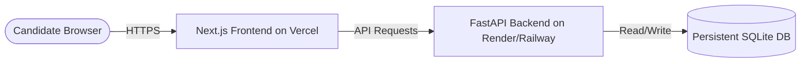

# 🚀 InterviewMind AI Deployment Guide

This document describes how to deploy **InterviewMind AI** to production using the absolute best practices: **Vercel** (for the Next.js frontend) and **Render** or **Railway** (for the FastAPI backend).

---

## 🎨 Architecture Overview


---

## 📦 Part 1: Deploying the FastAPI Backend (Render)

Render is the easiest, most reliable free-tier cloud platform for deploying Python services.

### Step 1: Create a Render Account
Go to [Render](https://render.com/) and sign up with your GitHub account.

### Step 2: Create a Web Service
1. Click **New +** and select **Web Service**.
2. Connect your `InterviewMind-AI` GitHub repository.
3. Configure the following service settings:
   - **Name:** `interviewmind-backend`
   - **Region:** Choose the region closest to you.
   - **Branch:** `main`
   - **Root Directory:** `backend`
   - **Runtime:** `Python`
   - **Build Command:** `pip install -r requirements.txt`
   - **Start Command:** `uvicorn main:app --host 0.0.0.0 --port $PORT`
   - **Instance Type:** `Free`

### Step 3: Configure Environment Variables
Click on **Advanced** or the **Environment** tab on Render and add your secrets:
```env
GROQ_API_KEY=your_groq_api_key_here
JWT_SECRET=your_random_jwt_secret_string
```

### Step 4: Click Deploy!
Render will build the dependencies and start the FastAPI server. Once deployed, note down the live URL (e.g. `https://interviewmind-backend.onrender.com`).

---

## 🖼️ Part 2: Deploying the Next.js Frontend (Vercel)

Vercel is the creator of Next.js and provides the highest speed, performance, and easiest setup.

### Step 1: Sign up on Vercel
Go to [Vercel](https://vercel.com/) and sign up with your GitHub account.

### Step 2: Import Project
1. Click **Add New** and select **Project**.
2. Import your `InterviewMind-AI` repository.
3. In the configure project settings:
   - **Framework Preset:** `Next.js`
   - **Root Directory:** Select **`frontend`** (click Edit and select the `frontend` folder).
   - **Build and Output Settings:** Leave default.

### Step 3: Add Environment Variables
Expand the **Environment Variables** section and add the connection link to your newly deployed backend:
- **Key:** `NEXT_PUBLIC_API_URL`
- **Value:** `https://interviewmind-backend.onrender.com` (use your live backend URL from Render)

### Step 4: Click Deploy!
Vercel will compile, build, and deploy your site in less than a minute. Your application is now live on a global CDN!

---

## 🛠️ GitHub Actions CI/CD
We have pre-configured a **GitHub Actions CI Pipeline** in `.github/workflows/ci.yml`. 
Every time you push changes to your repository, GitHub will automatically:
1. Verify Python backend packages and build syntax.
2. Verify Node.js packages and compile the Next.js production build.

This guarantees that your main branch remains continuously deployable and recruiter-ready.
