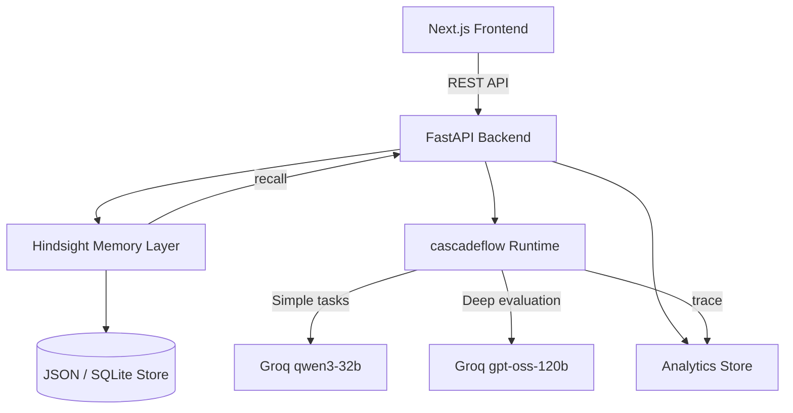

# InterviewMind AI

**AI-powered technical interview preparation with persistent memory and intelligent runtime model routing.**

---

## Overview

InterviewMind AI is a production-grade interview coaching platform that fundamentally changes how candidates prepare for technical interviews. Unlike generic quiz tools, it builds a persistent memory profile across every session, adapts its questioning strategy as you improve, and routes AI model calls intelligently to optimize both quality and cost.

**Core differentiators:**
- **Hindsight Memory** — the AI never forgets your weaknesses
- **cascadeflow Runtime Intelligence** — smart model routing for cost-efficiency
- **Adaptive Difficulty** — questions adapt to your actual performance history
- **Full Cost Transparency** — every token tracked, every routing decision logged

---

## Architecture



---

## Tech Stack

| Layer | Technology |
|---|---|
| Frontend | Next.js 14, TailwindCSS, TypeScript |
| Backend | FastAPI, Python 3.11+ |
| AI Models | Groq (qwen/qwen3-32b, openai/gpt-oss-120b) |
| Memory | Hindsight (custom persistent memory service) |
| Runtime | cascadeflow (custom model routing layer) |
| Charts | recharts |
| Animations | framer-motion |

---

## Project Structure

```
InterviewMind AI/
├── frontend/                   # Next.js 14 application
│   ├── app/
│   │   ├── page.tsx            # Landing page
│   │   ├── interview/          # Interview session
│   │   ├── memory/             # Memory dashboard
│   │   ├── analytics/          # Cost analytics
│   │   └── history/            # Session history
│   ├── components/             # Shared UI components
│   └── lib/                    # API client + types
├── backend/                    # FastAPI application
│   ├── main.py                 # App entrypoint
│   ├── routers/                # API route handlers
│   ├── services/
│   │   ├── hindsight.py        # Persistent memory
│   │   ├── cascadeflow.py      # Model routing
│   │   └── groq_client.py      # Groq API wrapper
│   ├── models/schemas.py       # Pydantic models
│   └── data/                   # Persistent JSON store
└── README.md
```

---

## Hindsight Memory

Hindsight is the persistent memory layer that transforms the platform from a generic quiz tool into a coaching system.

**Three core operations:**

| Operation | What it does |
|---|---|
| `retain(user_id, session_data)` | Stores session outcomes: weak concepts, scores, mistakes |
| `recall(user_id, topic)` | Retrieves relevant past weaknesses for prompt injection |
| `reflect(user_id)` | Generates improvement trend analysis and recommendations |

**Demo behavior:**
1. Session 1 → User fails DBMS normalization
2. Hindsight stores: `{"topic": "DBMS", "concept": "transitive dependencies", "times_failed": 1}`
3. Session 5 → AI recalls: *"You've struggled with transitive dependencies 3 times. Let's revisit with a harder scenario."*

---

## cascadeflow Runtime Intelligence

cascadeflow is the model routing layer that balances response quality against API cost.

**Routing table:**

| Task | Model Tier | Reason |
|---|---|---|
| Question generation | Fast (qwen3-32b) | Simple generation, low complexity |
| Answer evaluation | Strong (gpt-oss-120b) | Deep semantic reasoning required |
| Feedback generation | Fast | Template-like, predictable output |
| High-complexity context | Escalate → Strong | Triggered when weak concepts detected |

**Cost impact:**
- Without routing: ~$0.004/token for all calls (strong model only)
- With cascadeflow: ~$0.001/token average (~65–75% reduction)
- Budget enforcement: if session token budget exhausted, forces fast model

**Runtime trace (per request):**
```json
{
  "model_used": "qwen/qwen3-32b",
  "tier": "fast",
  "reason": "Question generation is a lightweight task. Using fast model to save cost.",
  "tokens_used": 312,
  "cost_usd": 0.000312,
  "latency_ms": 487,
  "escalated": false
}
```

---

## Setup Instructions

### Prerequisites
- Node.js 18+
- Python 3.11+
- Groq API key (get one at [groq.com](https://groq.com))

### Backend

```bash
cd backend

# Create virtual environment
python -m venv venv
source venv/bin/activate  # Windows: venv\Scripts\activate

# Install dependencies
pip install -r requirements.txt

# Configure environment
cp .env.example .env
# Edit .env and add your GROQ_API_KEY

# Start server
uvicorn main:app --reload --port 8000
```

Backend runs at `http://localhost:8000`
API docs available at `http://localhost:8000/docs`

### Frontend

```bash
cd frontend

# Install dependencies
npm install

# Configure environment
# Edit .env.local if backend is not on localhost:8000

# Start development server
npm run dev
```

Frontend runs at `http://localhost:3000`

---

## API Endpoints

### Interview
| Method | Endpoint | Description |
|---|---|---|
| POST | `/api/interview/start` | Start session (triggers memory recall) |
| POST | `/api/interview/answer` | Submit answer (triggers evaluation) |
| POST | `/api/interview/complete` | Finalize session (triggers memory retain) |
| GET | `/api/interview/history/{user_id}` | All past sessions |

### Memory
| Method | Endpoint | Description |
|---|---|---|
| GET | `/api/memory/{user_id}/profile` | Full memory profile |
| GET | `/api/memory/{user_id}/timeline` | Chronological event log |
| GET | `/api/memory/{user_id}/reflect` | Improvement analysis |
| GET | `/api/memory/{user_id}/recall` | Recall memories for a topic |

### Analytics
| Method | Endpoint | Description |
|---|---|---|
| GET | `/api/analytics/cost` | Cost breakdown |
| GET | `/api/analytics/routing` | Routing decision log |
| GET | `/api/analytics/summary` | Full analytics summary |

---

## Environment Variables

### Backend (`backend/.env`)

```env
GROQ_API_KEY=your_groq_api_key_here
FAST_MODEL=qwen/qwen3-32b
STRONG_MODEL=openai/gpt-oss-120b
MAX_TOKENS_PER_SESSION=4000
COST_PER_TOKEN_FAST=0.000001
COST_PER_TOKEN_STRONG=0.000004
```

### Frontend (`frontend/.env.local`)

```env
NEXT_PUBLIC_API_URL=http://localhost:8000
```

---

## Demo Walkthrough

**Recommended demo flow to showcase memory and routing:**

1. **Start interview** → Select DBMS, Medium difficulty
2. **Answer poorly** on normalization question → score < 6
3. **Complete session** → weaknesses stored in Hindsight
4. **Start new session** → observe Memory Recalled banner
5. **Watch AI adapt** → harder normalization question targeting your weakness
6. **Open Analytics** → see fast vs strong model routing, cost breakdown
7. **Open Memory Dashboard** → view timeline of weakness detection and recall events

---

## Deployment

### ⚡ 1-Click Cloud Deployment

You can deploy the entire application to the cloud with a single click using these integrated buttons:

[](https://vercel.com/new/clone?repository-url=https%3A%2F%2Fgithub.com%2FGouravGL%2FInterviewMind-AI&root-directory=frontend)
&nbsp;&nbsp;&nbsp;&nbsp;
[](https://render.com/deploy?repo=https://github.com/GouravGL/InterviewMind-AI)

---

### Backend → Render

1. Create a new Web Service on [render.com](https://render.com)
2. Set root directory to `backend/`
3. Build command: `pip install -r requirements.txt`
4. Start command: `uvicorn main:app --host 0.0.0.0 --port $PORT`
5. Add environment variables from `.env`

### Frontend → Vercel

1. Connect repository to [vercel.com](https://vercel.com)
2. Set root directory to `frontend/`
3. Add environment variable: `NEXT_PUBLIC_API_URL=https://your-render-backend.onrender.com`
4. Deploy

---

## Key Design Decisions

**Why JSON file storage?**
Simple, zero-dependency persistence that works without any database setup. For production scale, the `hindsight.py` and `cascadeflow.py` services can be backed by PostgreSQL or Redis with minimal interface changes.

**Why no authentication?**
User identity is managed via a localStorage-generated ID. This keeps the demo frictionless. Adding Auth.js or Clerk is straightforward.

**Why custom Hindsight and cascadeflow implementations?**
These services are implemented as clean, well-documented Python modules following the documented API design — making the memory and routing logic transparent, auditable, and extensible.

---

## Screenshots

> Add screenshots of:
> - Landing page hero
> - Interview session with routing badge
> - Memory dashboard with weakness profile
> - Analytics dashboard with cost charts
> - Session history with expandable details

---

## License

MIT
